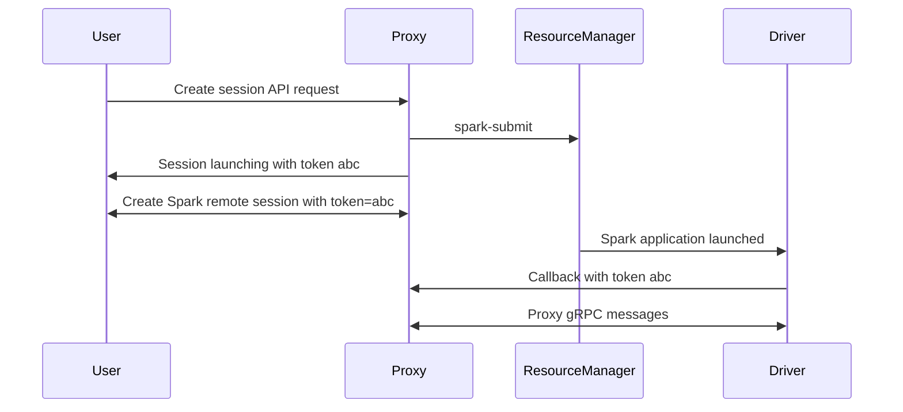

# Spark Connect Proxy

Spark Connect Proxy serves as both an API for creating remote Spark sessions and a proxy for accessing remote [Spark Connect](https://spark.apache.org/docs/latest/spark-connect-overview.html) sessions in a distributed compute environment such as YARN.

Spark Connect provides a new way to interact with Spark sessions remotely, but has a few limitations preventing it from being usable in a secure, multi-tenant, distributed compute environment:
- There is no built-in authentication mechanism. Any session started in a remote cluster accessible by other users can be connected to by any other user that knows about it. Spark documentation suggests using external proxies to enforce security, but this is not possible in flat distributed compute environments such as YARN.
- There is no built-in discovery mechanism. YARN uses a flat networking model using ephemeral ports on the NodeManagers. To utilize Spark Connect with YARN you must use client mode, running your driver outside of YARN on a dedicated machine. This does not work for multi-tenant environments, as users would not be able to spin up custom VMs for running their drivers. This also prevents users from being able to utilize all the compute provided in their clusters for driver resources.

This project aims to solve these problems by acting as a proxy between users and compute clusters. Sessions work as follows:
1. Users launch a new Spark session via an API request to the proxy server. The proxy server authenticates the user, and launches a new Spark session in the configured remote cluster. This remote session is secured with a randomly generated token which is provided to the user.
2. On startup, the remote Spark driver sends a callback to the proxy server with the location (IP and port) of the Spark Connect server running on the driver.
3. The user launches a new remote Spark session, using the proxy server as the location and the token as the client token.
4. The proxy server sees a new remote Spark session coming through, parses the token, looks up the Spark Connect server location based on the provided token, and then acts as a simple HTTP/2 proxy for the gRPC session between user and connect server.

This is demonstrated in the following graph:


The functionality is still evolving. Goals of the project include:
- Session tracking and timeouts, automatically killing sessions if they have been inactive for a configurable amount of time.
- HA support via a remote session store, such as a database.
- Highly configurable Spark setups, including multiple Spark versions, and configuration options that always override user provided values to ensure things like auditing listeners cannot be overridden.

## Project layout
There are three main pieces that make up the project: the server, the plugin, and clients.

### Server
The server is a Rust project that provides an authenticated API for creating and managing sessions, as well as dynamic HTTP/2 proxying of remote Spark sessions. Why Rust?
- Rust is cool and fun to learn
- Rust is fast, which is important for acting as a proxy between a potentially large number of remote Spark sessions
- Rust provides the building blocks necessary to act as a gRPC proxy via pure HTTP/2. Python HTTP/2 support lacks trailing header support which is required for gRPC. Netty is convoluted and who needs more Java in their life?

The server is implemented as a raw [Hyper](https://github.com/hyperium/hyper) server that intercepts requests and then:
- If the path starts with `spark.connect.SparkConnectService`, treats it as an incoming Spark gRPC connection and starts forwarding all packets between user and Spark Connect server.
- Otherwise forwards the request to an [Axum](https://github.com/tokio-rs/axum) router that provides the REST API.

#### Authentication
Supported authentication methods are:
- `remote_user` - authentication is handled by a trusted reverse proxy, user is based on a header provided
- `jwt` - JWT provided in header and verified with local copy of public certificate that signed the JWT
- `jwks` - JWT provided in header and verified through external JWKS or OIDC url endpoint.

#### Configuring the server
A full list of possible configs for the server are listed in the example [config.yaml](./conf/config.yaml).

### Plugin
The plugin provides the special logic in the Spark driver that allows the proxy to interact with the Spark Connect server.
- A SparkListener that sends a callback message to the proxy providing the location of the Spark Connect server on successful startup
- A gRPC ServerInterceptor that tracks user activity for timeout purposes and allows for custom messages from the proxy for things like killing sessions via API request
- Authentication was previously provided within the ServerInterceptor, but now is built-in to Spark 4.0 via the `spark.connect.authenticate.token` config.

### Clients
A directory of various clients for talking to the API and creating sessions. They are very thin wrappers around basic HTTP requests and an existing Spark Connect client implementation. Current example clients are:
- `python`: This is what most users likely use. It also implements a custom client interceptor that allows for using a token with non-TLS secured sessions, which is not possible with the current PySpark client.
- `rust`: This is mostly for integration test purposes, but if you feel so inclined to do real work with it why not.

Other clients may be implemented in the future, but they are simple to recreate in any language that has existing Spark Connect client support.

## Building

### Build the Spark plugin
The Spark plugin is built using [SBT](https://www.scala-sbt.org/download/) and requires Java 17+.

```bash
sbt package
```

### Run the server locally
[Install Rust](https://www.rust-lang.org/tools/install)

```bash
cargo run
```

### Run tests
[Install UV](https://docs.astral.sh/uv/getting-started/installation)
The integration test requires access to Spark, which can be installed through the parent UV project.

```bash
uv sync
source .venv/bin/activate
cargo test
```

### Build the release binary
```bash
cargo build --release
```

### Build the release binary with the plugin baked in and unpacked at runtime
```bash
cargo build --release --features embed-plugin
```

### Docker image
To build the Docker image with the server and plugin built-in:

```bash
docker build -t spark-connect-proxy .
```

This includes a version of Spark. To build a Sparkless image to add your own Spark version (or multiple Spark versions):

```bash
docker build -t spark-connect-proxy --target base .
```
